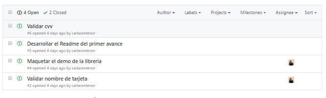
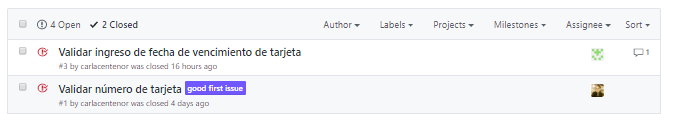
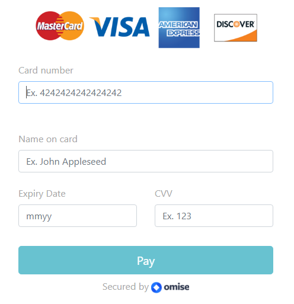
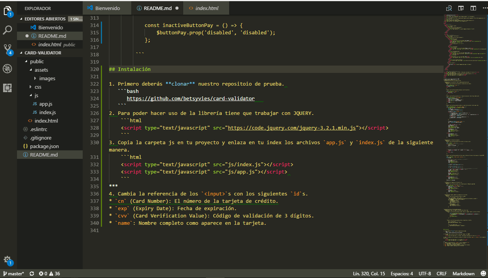

# Validador de datos de tarjetas de crédito

**Validador de datos de tarjetas de crédito** es una librería que permite `validar una tarjeta de crédito`
(usando algoritmo de Luhn), `fecha de vencimiento`, `código de verificación (cvv)` y `nombre completo` que aparece en la tarjeta.

***
## Plan de trabajo

#### 1. Decisión del reto a desarrollar.

#### 2. Se realiza un `Fork` al repositorio original

```
https://github.com/Laboratoria-learning/card-validator
```

#### 3.Planificación

Se planifico las actividades a desarrollar mediante issues para identificar los problemas y además asignar tareas a los colaboradores de dicho proyecto con el fin de tener una mejor organización.



#### 4. Recursos

##### 4.1. Babel
Herramienta para poder transformar nuestro código JS de ultima generación.

##### 4.2. Visual Studio Code
Editor de código fuente.

##### 4.3. Jquery
Librería de JavaScript de código abierto que permite agregar interactividad y efectos visuales.

##### 4.4. Bootstrap
 Framework que permite facilitar el desarrollo.

##### 4.5. Google Fonts
Directorio interactivo que permite añadir tipografias a la web.

#### 5. Desarrollo de la librería
* Inicializando proyecto con `npm init` y `git init`.
* Instalación de las dependencias package.json y Babel.
* Estructuración de carpetas
* Creación  `.gitignore`(para ignorar carpetas).

```
# Dependency directories
node_modules/
```

* Creación del `index.html`.
* Maquetación para el ejemplo principal
 ```html
      <!DOCTYPE html>
<html lang="en">

<head>
  <meta charset="UTF-8">
  <meta name="viewport" content="width=device-width, initial-scale=1.0">
  <meta http-equiv="X-UA-Compatible" content="ie=edge">
  <title>Validación de Tarjeta</title>
  <!-- Import Google Font -->
  <link href="https://fonts.googleapis.com/css?family=Lobster" rel="stylesheet">
  <!-- Import Font Awesome -->
  <link rel="stylesheet" href="https://maxcdn.bootstrapcdn.com/font-awesome/4.7.0/css/font-awesome.min.css">
  <!--Import Bootstrap.css-->
  <link type="text/css" rel="stylesheet" href="https://maxcdn.bootstrapcdn.com/bootstrap/4.0.0/css/bootstrap.min.css">
  <link type="text/css" rel="stylesheet" href="css/main.css">
</head>

<body>
  <!-- Card Container -->
  <header>
    <div class="container-fluid">
      <div class="row">
        <div class="col-xs-12 col-lg-12 center">
          <div class="col-xs-12 col-lg-4">
            
          </div>
        </div>
      </div>
    </div>
  </header>

  <section>
    <!-- Registry Container -->
    <div class="container-fluid center">
      <div class="row">
        <div class="col-xs-12 col-lg-12 container">
          <form action="">
            <div class="form-group">
              <div class="col-12">
                <label for="cn" class="col-form-label">Card number</label>
                <input type="text" name="cn" class="form-control inline" id="cn" placeholder="Ex. 4242424242424242" maxlength="16">
                <div class="">
                  
                </div>
              </div>
            </div>
            <div class="form-group">
              <div class="col-12">
                <label for="name" class="col-form-label">Name on card</label>
                <input type="text" name="name" class="form-control" id="name" placeholder="Ex. John Appleseed">
              </div>
            </div>
            <div class="form-group group">
              <div class="col-6">
                <label for="exp" class="col-form-label">Expiry Date</label>
                <input name="exp" class="form-control" type="text" id="exp" placeholder="mmyy" maxlength="4">
                <div id="message"></div>
              </div>
              <div class="col-6">
                <label for="cvv" class="col-form-label">CVV</label>
                <input type="password" name="cvv" class="form-control" id="cvv" placeholder="Ex. 123">
              </div>
            </div>
            <div class="col-12 container-button">
              <input id="button-pay" type="submit" class="btn btn-info btn-lg btn-block" disabled value="Pay" />
            </div>
          </form>
          <div class="center">
            <p>
              Secured by 
            </p>
          </div>
        </div>
      </div>
    </div>
    </div>
  </section>

  <!-- Import jQuery and Bootstrap.js -->
  <script type="text/javascript" src="https://code.jquery.com/jquery-3.2.1.min.js"></script>
  <script type="text/javascript" src="https://maxcdn.bootstrapcdn.com/bootstrap/4.0.0/js/bootstrap.min.js"></script>
  <script type="text/javascript" src="js/index.js"></script>
  <script type="text/javascript" src="js/app.js"></script> 
</body>

</html>
 ```
 ***

 ***

* Creación de los issues.
* Implementación de la funcionalidad esencial.

  * Validación de la tarjeta de crédito (usando algoritmo de Luhn).
    * Objetivos:
      * Definir una función que solo permita el ingreso de solo números.
      ```js
       const onlyNumberCard = (num) => {
       if (number.test(num)) {
       return true;
         } 
       };
      ```
      * Definir una función que permita ingresar solo 16 caracteres.
       ```js
       const maxLengthCard = (num) => {
        if (num.length === 16) {
            return true;
          } 
        };
      ```
      * Definir una función que permita ver el tipo de tarjeta de crédito (Visa, Mastercard).
      ```js
       const validateTypeCard = (num, images) => {
        if (num.match(validateVisa)) {
            images.attr('src', visaImg);
        } else if (num.match(validateMastercard)) {
            images.attr('src', mastercardImg);
        } else {
            images.attr('src', '');
        }
        };
      ```
      * Definir una función que permita validar el número de tarjeta de crédito según Luhn.
      ```js
       const validateNumberCard = (num, input, images) => {
        if (maxLengthCard(num) && onlyNumberCard(num)) {
            let sum = 0;
            let arrayCard = num.split('');
            let arrayReverse = arrayCard.reverse();

            arrayReverse.forEach((element, i) => {
            if (i % 2 !== 0) {
                let elementSelection = parseInt(arrayReverse[i]) * 2;
                if (elementSelection >= 10) {
                let elementFinal = parseInt(elementSelection / 10) + elementSelection % 10;
                arrayReverse[i] = elementFinal;
                } else {
                let otherElement = parseInt(arrayReverse[i]) * 2;
                arrayReverse[i] = otherElement;
                }
            }
            });

            arrayReverse.forEach((element, index) => {
            sum += parseInt(arrayReverse[index]);
            });

            if (sum > 0 && sum % 10 === 0) {
            validateNumCard = true;
            input.addClass('success');
            input.removeClass('error');
            validateTypeCard(num, images);
            } else {
            validateNumCard = false;
            input.addClass('error');
            input.removeClass('success');
            images.attr('src', '');
            }
        } else {
            validateNumCard = false;
            input.addClass('error');
            input.removeClass('success');
            images.attr('src', '');
        }
        };

      ```
  * Validación de la fecha de vencimiento.
    * Objetivos:
      * Definir una función que permita solo números retroceso y enter.
      ```js
       const onlyNumber = (evt) => {
        /* Asignamos el valor de la tecla a keynum */
        if (window.event) {
            keynum = evt.keyCode; // IE
        } else {
            keynum = evt.which; // FF
        }

        /* comprobamos si se encuentra en el rango numérico */
        if ((keynum > 47 && keynum < 58) || keynum === 8 || keynum === 13) {
            return true;
        } else {
            return false;
        }
        };
      ```
      * Definir una función que permita verificar que la fecha escrita sea corresta según el formato MMYY.
      ```js
       const validateDate = (date, input, sentence) => {
        let message = '';

        /* Si la fecha está completa comenzamos la validación */
        if (date.length === 4) {
            validateDateCard = true;
            input.addClass('success');
            input.removeClass('error');

            /* Extraemos el mes */
            let month = parseInt(date.substr(0, 2));

            /* Extraemos en año */
            let year = parseInt(date.substr(2, 2));

            /* Si las partes de la fecha concuerdan con las que digitamos, es correcta */
            if ((year <= 99) && (month > 0 && month <= 12)) {
            message = 'Fecha correcta';
            input.addClass('success');
            input.removeClass('error');
            } else {
            message = 'Fecha incorrecta';
            input.addClass('error');
            input.removeClass('success');
            }
        } else {
            validateDateCard = false;
            input.addClass('error');
            input.removeClass('success');
        }
        sentence.html(message);
        };
      ```
  *  Validación del código de verificación (cvv).
    * Objetivos:
      * Definir una función que acepte solo 3 dígitos para el código de seguridad.
      ```js
       const validateCode = (cvv, input) => {
        if (number.test(cvv) && cvv.length === 3) {
            validateCvv = true;
            input.addClass('success');
            input.removeClass('error');
        } else {
            validateCvv = false;
            input.addClass('error');
            input.removeClass('success');
        }
        };
      ```
  * Validación del nombre completo que aparece en la tarjeta.
    * Objetivos:
      * Definir una función que permita validar el nombre.
        ```js
             const validateName = (name, input) => {
            /* Usaremos una expresion regular para validar que escriba bien su nombre */
            var PATERNNAME = /^([a-z ñáéíóú]{2,60})$/i;
            if (PATERNNAME.test(name)) {
                validateNameUser = true;
                input.addClass('success');
                input.removeClass('error');
            } else {
                validateNameUser = false;
                input.addClass('error');
                input.removeClass('success');
            }
            };
        ```

* Implementación de la funcionalidad opcional.
  * Validación de todos los campos y activación del button (Pay)
    * Objetivos:
        * Definir una función que permita validar todos los campos (inputs) y active el button.
         ```js
                const areAllValidationsPassing = () => {
                if (validateNumCard && validateNameUser && validateDateCard && validateCvv) {
                formStateEvent();
                } else {
                inactiveButtonPay();
                }
            };

      ```
        * Definir una función que permita activar y desactivar el button.
         ```js
            const formStateEvent = () => {
            $buttonPay.prop('disabled', false);
            };

            const inactiveButtonPay = () => {
                $buttonPay.prop('disabled', 'disabled');
            };

         ```
***
## Instalación...!!!

1. Primero deberás **clonar** nuestro repositorio de prueba. 
   ```bash
      https://github.com/betsyvies/card-validator   
   ```
2. Para poder hacer uso de la librería tiene que trabajar con JQUERY.
    ```html
    <script type="text/javascript" src="https://code.jquery.com/jquery-3.2.1.min.js"></script>
    ```
3. Copia la carpeta js en tu proyecto y enlaza en tu index los archivos `app.js` y `index.js` de la siguiente manera.
    ```html
    <script type="text/javascript" src="js/index.js"></script>
    <script type="text/javascript" src="js/app.js"></script> 
    ```

4. Cambia la referencia de los `<input>`s con los siguientes `id`s.
* `cn` (Card Number): El número de la tarjeta de crédito.
* `exp` (Expiry Date): Fecha de expiración.
* `cvv` (Card Verification Value): Código de validación de 3 dígitos.
* `name`: Nombre completo como aparece en la tarjeta.
***
## Funcionalidad



***

## Colaboradores

* Carla centeno
* Betsy Vidal
* Eleyne Ramírez